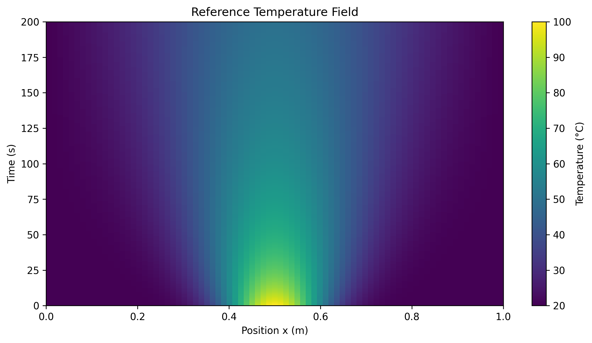
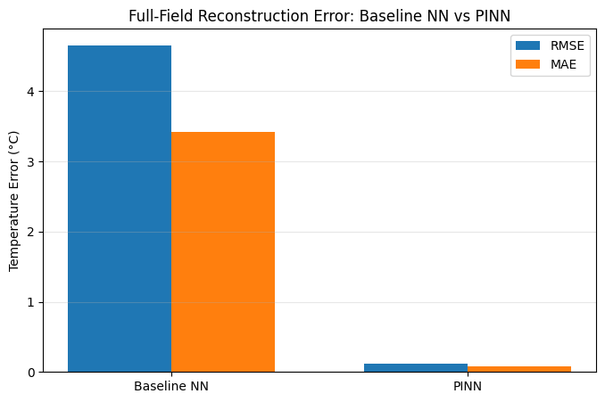
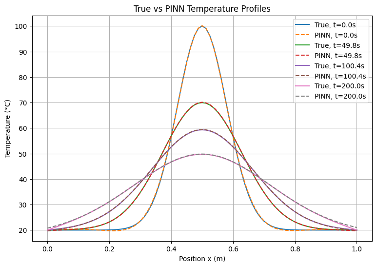
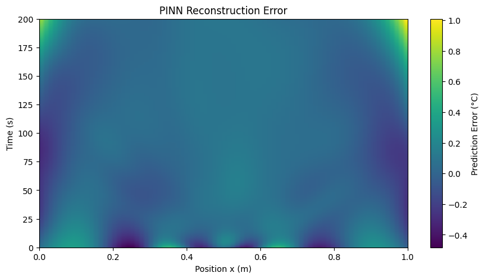
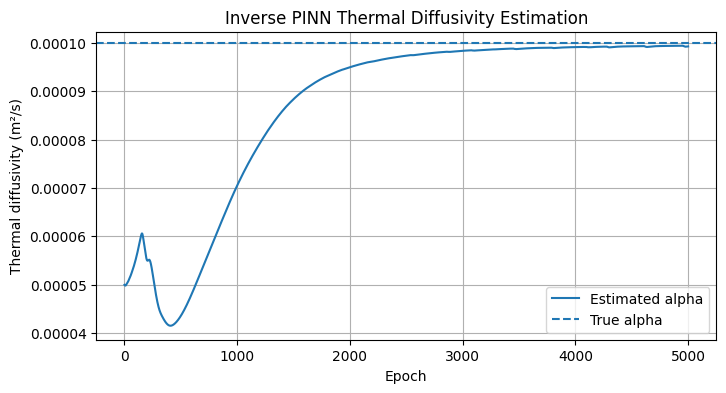
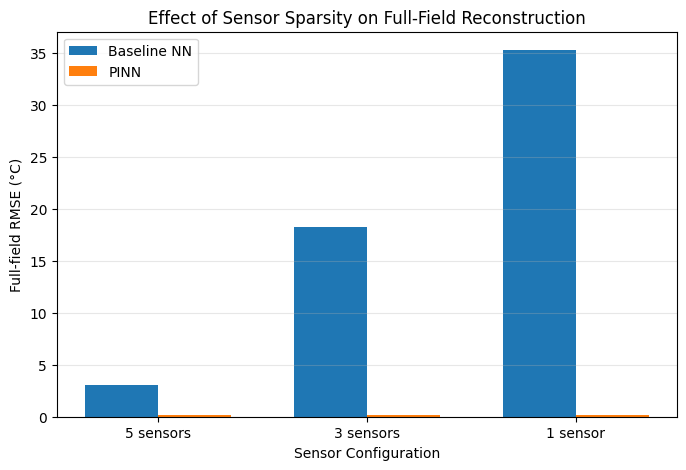

# Physics-Informed Thermal Digital Twin

A Scientific Machine Learning project for reconstructing the temperature field of a transient thermal system from sparse, noisy, and incomplete sensor measurements.

The project combines:

- numerical solution of the 1D heat equation,
- synthetic sensor measurements,
- a data-driven neural-network baseline,
- a Physics-Informed Neural Network (PINN),
- inverse estimation of thermal diffusivity,
- and robustness analysis under reduced sensor availability.

The project is implemented in Python and PyTorch.

---

## Project Overview

Many engineering systems cannot be observed at every spatial location.

Instead, only a limited number of sensors may be available, and those measurements may contain noise or missing values.

This project investigates whether known physical laws can improve reconstruction of the complete temperature field:

$$
T(x,t)
$$

from sparse measurements.

The central comparison is between:

$$
\text{Data-driven Neural Network}
$$

and:

$$
\text{Physics-Informed Neural Network}
$$

The project is then extended to an inverse problem in which the thermal diffusivity is treated as an unknown trainable physical parameter.

---

## Physical System

The system is a one-dimensional rod governed by the transient heat equation:

$$
\frac{\partial T}{\partial t}
=
\alpha
\frac{\partial^2T}{\partial x^2}
$$

where:

- $T(x,t)$ is temperature,
- $x$ is spatial position,
- $t$ is time,
- $\alpha$ is thermal diffusivity.

The rod length is:

$$
L=1\,m
$$

with fixed-temperature boundary conditions:

$$
T(0,t)=T(1,t)=20^\circ C
$$

The initial temperature distribution is a Gaussian hot spot centered at the middle of the rod:

$$
T(x,0)
=
20
+
80
\exp
\left(
-\frac{(x-0.5)^2}{2(0.08)^2}
\right)
$$

The reference thermal diffusivity is:

$$
\alpha
=
1.0\times10^{-4}\;m^2/s
$$

---

## Numerical Heat Simulation

The governing PDE is solved using the explicit Forward-Time Centered-Space (FTCS) finite-difference method:

$$
T_i^{n+1}
=
T_i^n
+
r
\left(
T_{i+1}^n
-
2T_i^n
+
T_{i-1}^n
\right)
$$

with:

$$
r=
\frac{\alpha\Delta t}{\Delta x^2}
$$

and the explicit stability requirement:

$$
r\leq0.5
$$

A grid-convergence study was performed:

| Grid | Center Temperature at 200 s |
|---|---:|
| $N_x=21$ | 49.4222 °C |
| $N_x=41$ | 49.6384 °C |
| $N_x=81$ | 49.6918 °C |

The reduction in successive differences was approximately consistent with the expected second-order spatial discretization behavior.

The $N_x=81$ solution was used as the synthetic reference field.

### Reference Temperature Field



---

## Synthetic Sensor System

Five virtual sensors were placed at:

$$
x=
0.20,\;
0.35,\;
0.50,\;
0.65,\;
0.80
$$

Gaussian measurement noise was added:

$$
T_{\text{measured}}
=
T_{\text{true}}
+
\epsilon
$$

where:

$$
\epsilon
\sim
\mathcal N(0,0.5^2)
$$

Approximately 5% of sensor measurements were then removed to simulate missing observations.

The resulting dataset therefore contains:

- sparse spatial measurements,
- Gaussian sensor noise,
- missing observations,
- and a complete reference field retained only for model evaluation.

---

## Data-Driven Baseline

A fully connected neural network was trained using only the available sensor measurements.

The model learns:

$$
(x,t)\rightarrow T
$$

using the architecture:

$$
2
\rightarrow
64
\rightarrow
64
\rightarrow
64
\rightarrow
1
$$

with `Tanh` activation functions.

Training used:

- Mean Squared Error loss,
- Adam optimization,
- an 80/20 train-validation split,
- learning-rate scheduling,
- and early stopping.

The baseline model has no explicit knowledge of:

- the heat equation,
- the boundary conditions,
- the initial temperature distribution,
- or thermal diffusivity.

### Baseline Result

| Metric | Result |
|---|---:|
| RMSE | 4.6569 °C |
| MAE | 3.4224 °C |

The model captured the general temperature evolution but produced larger reconstruction errors in regions with limited sensor coverage.

---

## Physics-Informed Neural Network

The PINN uses the same neural-network architecture but incorporates the governing physics during training.

The normalized heat-equation residual is:

$$
f(x^*,t^*)
=
\frac{\partial T^*}{\partial t^*}
-
\alpha^*
\frac{\partial^2T^*}{\partial x^{*2}}
$$

where:

$$
\alpha^*
=
\frac{\alpha\Delta t}{\Delta x^2}
$$

For this system:

$$
\alpha^*=0.02
$$

PyTorch automatic differentiation is used to calculate:

$$
\frac{\partial T}{\partial t}
$$

and:

$$
\frac{\partial^2T}{\partial x^2}
$$

directly from the neural network.

The total loss is:

$$
\mathcal L_{\text{total}}
=
\mathcal L_{\text{data}}
+
\mathcal L_{\text{physics}}
+
\mathcal L_{\text{boundary}}
+
\mathcal L_{\text{initial}}
$$

The four terms enforce:

- agreement with sensor measurements,
- satisfaction of the heat equation,
- fixed-temperature boundary conditions,
- and the known initial temperature distribution.

### PINN Result

| Metric | Baseline NN | PINN |
|---|---:|---:|
| RMSE | 4.6569 °C | 0.1163 °C |
| MAE | 3.4224 °C | 0.0838 °C |

### Reconstruction Error Comparison



### True vs PINN Temperature Profiles



### PINN Error Field



For this controlled matched-physics experiment, incorporating the governing physical model substantially improved full-field reconstruction.

---

## Inverse Parameter Estimation

The project was extended to an inverse problem in which thermal diffusivity was treated as unknown.

Instead of optimizing $\alpha$ directly, the model learns:

$$
\eta=\log(\alpha)
$$

with:

$$
\alpha=e^\eta
$$

This guarantees that the estimated diffusivity remains positive.

The inverse PINN was deliberately initialized with:

$$
\alpha_{\text{initial}}
=
5.0\times10^{-5}\;m^2/s
$$

while the hidden reference value was:

$$
\alpha_{\text{true}}
=
1.0\times10^{-4}\;m^2/s
$$

The neural-network parameters and the physical parameter were optimized simultaneously.

### Parameter Identification Result

The final estimate was:

$$
\alpha_{\text{estimated}}
=
9.928\times10^{-5}\;m^2/s
$$

with a relative error of approximately:

$$
0.72\%
$$

The inverse PINN simultaneously reconstructed the temperature field with:

| Metric | Inverse PINN |
|---|---:|
| RMSE | 0.1695 °C |
| MAE | 0.1337 °C |

### Thermal Diffusivity Estimation



The result demonstrates simultaneous state reconstruction and physical parameter identification from sparse and noisy measurements.

---

## Robustness to Sensor Sparsity

A final experiment investigated how reconstruction performance changes as spatial measurements become increasingly sparse.

Three sensor configurations were used:

- **5 sensors:** 0.20, 0.35, 0.50, 0.65, 0.80 m
- **3 sensors:** 0.20, 0.50, 0.80 m
- **1 sensor:** 0.50 m

Available observations were:

| Configuration | Observations |
|---|---:|
| 5 sensors | 1351 |
| 3 sensors | 808 |
| 1 sensor | 268 |

Both the baseline NN and PINN were independently trained using the same standardized experimental pipeline.

| Sensors | Baseline RMSE | Baseline MAE | PINN RMSE | PINN MAE |
|---|---:|---:|---:|---:|
| 5 | 3.0289 °C | 1.9922 °C | 0.1230 °C | 0.0883 °C |
| 3 | 18.2571 °C | 12.4429 °C | 0.1612 °C | 0.1300 °C |
| 1 | 35.2641 °C | 27.8196 °C | 0.1269 °C | 0.0910 °C |

### Sensor-Sparsity Comparison



The data-driven model deteriorated strongly as sensor coverage decreased.

In contrast, the PINN remained accurate because the governing PDE, thermal diffusivity, boundary conditions, and initial condition continued to constrain the solution.

The small non-monotonic difference between the one-sensor and three-sensor PINN results should not be interpreted as evidence that fewer sensors are preferable.

Repeated experiments across multiple random seeds would be required to quantify these smaller differences statistically.

---

## Key Results

| Experiment | RMSE | MAE |
|---|---:|---:|
| Data-driven baseline | 4.6569 °C | 3.4224 °C |
| PINN with known thermal diffusivity | 0.1163 °C | 0.0838 °C |
| Inverse PINN with learned thermal diffusivity | 0.1695 °C | 0.1337 °C |

For the inverse problem:

$$
\alpha_{\text{true}}
=
1.0\times10^{-4}\;m^2/s
$$

$$
\alpha_{\text{estimated}}
=
9.928\times10^{-5}\;m^2/s
$$

with approximately:

$$
0.72\%
$$

relative parameter-estimation error.

---

## Main Findings

The project demonstrates that:

- the FTCS solver produces stable transient heat-diffusion simulations and shows grid convergence,
- sparse, noisy, and incomplete measurements can be used for full-field reconstruction,
- a purely data-driven neural network becomes increasingly unreliable as sensor coverage decreases,
- incorporating the governing PDE and physical constraints substantially improves reconstruction in a matched-physics setting,
- an inverse PINN can simultaneously reconstruct the temperature field and identify an unknown physical parameter,
- thermal diffusivity can be recovered with low relative error in this controlled experiment,
- and physics-informed learning can remain robust when measurement information becomes highly sparse.

---

## Scientific Interpretation

The strong PINN performance should be interpreted in the context of the experimental design.

The synthetic reference field was generated using the same governing heat equation, initial-condition formulation, and boundary conditions supplied to the PINN.

The project therefore represents a controlled **matched-physics experiment**.

The results demonstrate the value of physics-informed learning when the governing physical model is accurately known.

They should not be interpreted as evidence that PINNs will always outperform purely data-driven models by the same margin in real engineering systems.

---

## Project Workflow

```text
Heat-equation formulation
        ↓
FTCS numerical solver
        ↓
Grid-convergence validation
        ↓
Synthetic reference temperature field
        ↓
Sparse, noisy and incomplete virtual sensors
        ↓
Data-driven neural-network baseline
        ↓
Physics-Informed Neural Network
        ↓
Inverse thermal-diffusivity estimation
        ↓
Sensor-sparsity robustness analysis
```

---

## Repository Structure

```text
physics_informed_thermal_digital_twin/
│
├── data/
│   ├── reference_temperature_field.npz
│   └── thermal_sensor_data.csv
│
├── figures/
│   ├── alpha_estimation.png
│   ├── baseline_vs_pinn_comparison.png
│   ├── pinn_error_heatmap.png
│   ├── reference_temperature_field.png
│   ├── sensor_sparsity_comparison.png
│   └── true_vs_pinn_profiles.png
│
├── notebooks/
│   ├── 01_heat_equation_basics.ipynb
│   ├── 02_numerical_heat_simulation.ipynb
│   ├── 03_sparse_sensor_data.ipynb
│   ├── 04_data_driven_baseline.ipynb
│   ├── 05_physics_informed_model.ipynb
│   └── 06_inverse_problem_and_robustness.ipynb
│
├── .gitignore
├── README.md
└── requirements.txt
```

---

## Notebook Structure

### `01_heat_equation_basics.ipynb`

Introduces:

- heat conduction,
- Fourier's law,
- the 1D heat equation,
- finite-difference approximations,
- FTCS,
- and numerical stability.

### `02_numerical_heat_simulation.ipynb`

Implements:

- the full numerical solver,
- Gaussian initial conditions,
- fixed-temperature boundaries,
- transient simulation,
- and grid-convergence analysis.

### `03_sparse_sensor_data.ipynb`

Creates:

- virtual sensors,
- noisy measurements,
- residual analysis,
- missing observations,
- and the synthetic ML dataset.

### `04_data_driven_baseline.ipynb`

Implements:

- data preparation,
- normalization,
- a fully connected neural-network baseline,
- model training,
- validation,
- and full-field reconstruction.

### `05_physics_informed_model.ipynb`

Implements:

- normalized PDE formulation,
- collocation points,
- automatic differentiation,
- physics loss,
- boundary and initial-condition losses,
- PINN training,
- and comparison with the data-driven baseline.

### `06_inverse_problem_and_robustness.ipynb`

Extends the project with:

- inverse thermal-diffusivity estimation,
- simultaneous state and parameter reconstruction,
- 5-, 3-, and 1-sensor experiments,
- and robustness analysis.

---

## Technologies

- Python
- NumPy
- Pandas
- Matplotlib
- PyTorch
- Jupyter Notebook
- VS Code

---

## Limitations

This project uses synthetic measurements rather than measurements from a real thermal system.

Important limitations include:

- the governing PDE is assumed to be exactly known,
- thermal diffusivity is spatially constant,
- the boundary conditions are perfectly known,
- the initial temperature field is known,
- measurement noise is Gaussian,
- missing observations are randomly generated,
- sensor bias and drift are not included,
- the reference simulator and PINN use matched physical assumptions,
- and robustness experiments use individual training runs rather than repeated trials across multiple random seeds.

The project should therefore be interpreted as a **Scientific Machine Learning and thermal digital-twin prototype**, rather than a validated digital twin of a real industrial asset.

---

## Possible Extensions

Future work could investigate:

- experimental temperature measurements,
- heterogeneous thermal materials,
- temperature-dependent diffusivity,
- uncertain or time-dependent boundary conditions,
- physics-model mismatch,
- sensor bias and drift,
- non-Gaussian measurement noise,
- anomaly detection,
- predictive maintenance,
- uncertainty quantification,
- repeated experiments across multiple random seeds,
- and extension from 1D to 2D thermal systems.

---

## Project Context

This project combines physics, numerical modelling, machine learning, and data science.

The main areas explored are:

- Scientific Machine Learning,
- Physics-Informed Machine Learning,
- numerical PDEs,
- sparse sensor data,
- inverse problems,
- parameter identification,
- digital twins,
- and engineering-system monitoring.

---

## Author

**Rupesh Khanal**

Background in Physics and Data Science.

Areas of interest:

- Scientific Machine Learning
- Physics-Informed Machine Learning
- Computational Modelling
- Scientific Computing
- Sensor and Time-Series Analysis
- Predictive Maintenance
- Digital Twins